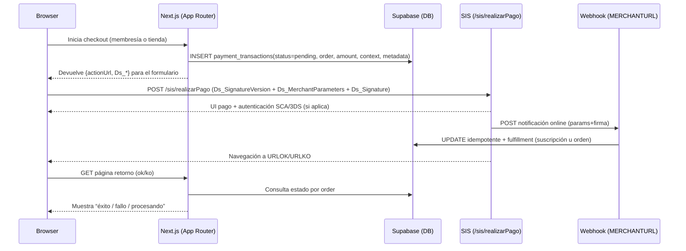

# Migración a Redirección en Redsys/Getnet para pagos únicos y suscripciones recurrentes en Next.js App Router con TypeScript

## Resumen ejecutivo

El estado actual de vuestro proyecto `lorensation/penya-madridista` cobra **pagos “CIT”** (compras en tienda + alta inicial de membresía) con **InSite (iframe)** y después intenta **autorizar vía REST** usando `idOper`, lo que en la práctica os bloquea por `SIS0218` (no permitido “Host to Host / WebService” para operaciones seguras en vuestra configuración). Esto se ve en el flujo implementado: `prepare*Payment()` genera `payment_transactions` en `pending`, la UI muestra `RedsysInSiteForm`, y el server action `executePayment()` llama a `authorizeWithIdOper()` que usa `trataPeticionREST`. 

La opción “segunda” (migrar checkout a **Redirección** usando `/sis/realizarPago`) es totalmente compatible con el objetivo de **pagos únicos** y además es la vía que **simplifica la autenticación 3DS/SCA**, porque el flujo de pantallas/autenticación lo gestiona el TPV. El contrato de Redirección es claro: construir un `POST` con `Ds_SignatureVersion`, `Ds_MerchantParameters` (JSON→Base64) y `Ds_Signature`, y enviarlo a `https://sis-t.redsys.es:25443/sis/realizarPago` (test) o `https://sis.redsys.es/sis/realizarPago` (real). 

Para suscripciones recurrentes (mensual/anual), la solución técnica robusta es:

- **Alta inicial (CIT)** por **Redirección**, solicitando **Tokenización/COF** (p. ej. `DS_MERCHANT_IDENTIFIER="REQUIRED"`, `DS_MERCHANT_COF_INI="S"`, `DS_MERCHANT_COF_TYPE="R"`). La respuesta incluye token (`Ds_Merchant_Identifier`) y TID COF (`Ds_Merchant_Cof_Txnid`).   
- **Renovaciones automáticas (MIT)** por backend usando **REST** con exención `DS_MERCHANT_EXCEP_SCA="MIT"` y `Ds_Merchant_DirectPayment=true`, vinculadas al TID de la operación original (COF). Esto está documentado como el patrón PSD2 esperado para suscripciones/MIT. 

Punto crítico (no técnico sino de adquirencia): si vuestro terminal sigue devolviendo `SIS0218`, la parte de renovaciones MIT (server-to-server) puede requerir **habilitación por la entidad**. La documentación de códigos indica literalmente `SIS0218` = “no permite operaciones seguras por entradas ‘operaciones’ o ‘WebService’”, y hay códigos adicionales que reflejan restricciones de exenciones MIT (p. ej. “no se puede marcar la exención MIT”). 

## Objetivo final y supuestos de integración

Objetivo funcional:

- **Suscripciones**: 3 tipos de membresía (under25/over25/family) con cobro **mensual o anual**; cobro inicial al alta + renovaciones automáticas.
- **Tienda**: compras de artículos físicos en un **pago único**.

Supuestos (cuando no hay datos explícitos):

- Stack adquirente: entity["company","Getnet","payment services santander"] / entity["company","Banco Santander","bank spain"]; entorno técnico “TPV Get Checkout ES” (documentación hospedada en `desarrolladores.santandertpv.es` y espejo `sis-d.redsys.es`).
- Firma: **HMAC_SHA256_V1** (no SHA512) para Redirección en este stack. Esto está explicitado en la guía de Redirección de “websantander” y en manuales HMAC SHA256.   
- Nota: existe otra documentación de Redsys (portal `pagosonline.redsys.es`) que muestra ejemplos con `HMAC_SHA512_V2`; no debéis mezclarla con esta integración si vuestro terminal y librería están en SHA256. 

## Qué exigen las especificaciones oficiales para Redirección, tokenización y MIT

### Redirección: campos, endpoint y condiciones de seguridad

Redirección exige:

- Formularios con **tres campos**:  
  `Ds_SignatureVersion`, `Ds_MerchantParameters` (Base64 de JSON), `Ds_Signature` (HMAC-256).   
- URL de envío:  
  test `https://sis-t.redsys.es:25443/sis/realizarPago`, real `https://sis.redsys.es/sis/realizarPago`.   
- Recomendación de seguridad: **validar firma y parámetros** de la notificación online *antes* de ejecutar lógica en servidor. 

La firma “HMAC_SHA256_V1” se calcula diversificando la clave con **3DES usando el número de pedido** y aplicando HMAC-SHA256 sobre el **`Ds_MerchantParameters` ya en Base64**. 

### Tokenización y COF para suscripciones

Tenéis dos piezas documentales clave (ambas del entorno Getnet/Redsys “websantander”):

- **Pago 1‑Click / Tokenización**: para generar una referencia/token, en la primera operación se envía `Ds_Merchant_Identifier="REQUIRED"`, y el sistema devuelve el token en `Ds_Merchant_Identifier` y la caducidad en `Ds_ExpiryDate` (en notificación online / URL OK / respuesta REST según el modo).   
- **COF**: para “COF inicial” con Redirección se envían `DS_MERCHANT_COF_INI="S"` y `DS_MERCHANT_COF_TYPE="R"` junto a `DS_MERCHANT_IDENTIFIER="REQUIRED"`, y la respuesta devuelve además `Ds_Merchant_Cof_Txnid` (TID COF).   

Ese `Ds_Merchant_Cof_Txnid` es especialmente importante en PSD2 porque vincula las operaciones sucesivas con la operación inicial (CIT autenticada). El documento COF también describe explícitamente el marcaje MIT (exención MIT + DirectPayment). 

### MIT y exenciones SCA

La guía de autenticación 3DS (EMV3DS) describe `DS_MERCHANT_EXCEP_SCA` y define `MIT` como exención para operaciones iniciadas por el comercio (suscripciones, recurrentes), indicando que el “mandato” inicial debe hacerse con operación autenticada con SCA. Además avisa que marcar exenciones mueve responsabilidad de fraude al comercio. 

En vuestro repo ya tenéis un módulo de renovaciones que carga MIT usando token + `COF_TXNID` y marca `DS_MERCHANT_EXCEP_SCA="MIT"` y `DS_MERCHANT_DIRECTPAYMENT="true"`.  

## Diseño recomendado del sistema y comparación de flujos

### Arquitectura objetivo

- **Checkout (CIT)** por Redirección para:
  - alta inicial de membresía (con tokenización/COF inicial)
  - pago único de tienda (sin tokenización)
- **Webhook (MERCHANTURL)** como única fuente de verdad y lugar donde ejecutar “fulfillment”:
  - activar suscripción + guardar token/COF TID
  - crear pedido + order_items + descontar inventario + persistir shipping
- **Renovaciones** (MIT) por cron en backend:
  - usa token + cof_txn_id
  - exención MIT + direct payment
  - requiere habilitación de entidad si hay restricciones (p. ej. `SIS0218` / “no se puede marcar MIT”) 

### Secuencia (timeline) recomendada



### Tabla comparativa de flujos

| Flujo | Uso recomendado en vuestro caso | Pros | Contras / riesgos |
|---|---|---|---|
| InSite + REST (`idOper` → `trataPeticionREST`) | **No** (os bloquea) | UX integrada sin salto | Complejidad EMV3DS Host-to-Host y, en vuestro caso, bloqueo por `SIS0218` (“WebService/Host to Host”). |
| Redirección-only (CIT) + Webhook | **Sí** para checkout (membresía inicial y tienda) | Reduce implementación 3DS/SCA; simplifica; evita llamadas REST en la parte interactiva | Requiere rediseñar a asincronía (webhook); UX con salto de navegación. |
| Redirección (CIT) + Tokenización/COF + MIT por REST | **Sí** para suscripciones completas (alta + renovaciones automáticas) | Modelo PSD2 estándar para suscripciones: CIT autenticada + MIT SCA-exempt | Renovaciones dependen de que la entidad permita exención MIT/Host-to-Host; posibles errores de configuración (`SIS0218`, `SIS0883`, `SIS0617`). |

La estructura de Redirección y su endpoint está documentada tanto en el manual clásico HMAC-SHA256 como en la guía de Redirección “websantander”.   
La evidencia de `SIS0218` y restricciones asociadas aparece en el glosario de códigos del portal de Santander TPV. 

## Implementación propuesta en `lorensation/penya-madridista` con cambios concretos

### Mapa del estado actual del repo (lo que vamos a sustituir)

- **Membresía**: `/src/app/membership/page.tsx` prepara el pago y luego muestra `RedsysInSiteForm` esperando `idOper` para llamar `executePayment(idOper, order, "membership")`.   
- **Tienda checkout**: `/src/app/tienda/(shop)/checkout/page.tsx` usa el mismo patrón con InSite.   
- **Server actions**: `/src/app/actions/payment.ts` implementa `executePayment()` llamando a `authorizeWithIdOper()` (REST).   
- **Webhook**: ya existe `/src/app/api/payments/redsys/notification/route.ts`, con verificación de firma y deduplicación básica; pero actualmente no hace fulfillment principal porque “se hace sincrónico en executePayment”. Esto cambiará.   
- **Crons MIT**: ya existe `/src/lib/redsys/recurring.ts` + endpoint `/src/app/api/payments/redsys/recurring/route.ts`. Se mantiene, pero su viabilidad depende de permisos de entidad si hay `SIS0218`. 

### Cambios de ficheros propuestos

#### Nuevo componente: `src/components/payments/redsys-redirect-form.tsx`

Auto-envía el POST a `/sis/realizarPago`.

```tsx
"use client"

import { useEffect, useRef } from "react"
import type { RedsysSignedRequest } from "@/lib/redsys/types"

export function RedsysRedirectAutoSubmitForm(props: {
  actionUrl: string
  signed: RedsysSignedRequest
}) {
  const formRef = useRef<HTMLFormElement>(null)

  useEffect(() => {
    formRef.current?.submit()
  }, [])

  return (
    <form ref={formRef} method="POST" action={props.actionUrl}>
      <input type="hidden" name="Ds_SignatureVersion" value={props.signed.Ds_SignatureVersion} />
      <input type="hidden" name="Ds_MerchantParameters" value={props.signed.Ds_MerchantParameters} />
      <input type="hidden" name="Ds_Signature" value={props.signed.Ds_Signature} />
      <noscript>
        <button type="submit">Continuar al pago</button>
      </noscript>
    </form>
  )
}
```

La estructura del formulario (tres campos + POST) y el endpoint `/sis/realizarPago` están documentados oficialmente. 

#### Nuevo helper server-side: Redirección usando vuestra firma existente (`HMAC_SHA256_V1`)

En vuestro repo ya existe:

- generador de pedido Redsys conforme a restricciones (12 chars, 4 primeros numéricos) en `order-number.ts`.   
- módulo de firma `HMAC_SHA256_V1` en `signature.ts`.   
- constructor de request firmado `buildSignedRequest()` en `client.ts`.   

Eso significa que **para Redirección no tenéis que reimplementar cripto**: podéis reutilizar `buildSignedRequest()` para construir `Ds_MerchantParameters` y `Ds_Signature` y solo cambiar el “destino”: en vez de POST JSON a `trataPeticionREST`, devolvéis el payload al cliente para postearlo a `/sis/realizarPago`. La guía de Redirección define exactamente este contrato. 

#### Server actions: reemplazar “prepare + execute(idOper)” por “prepareRedirectPayload”

Propuesta: añadir dos server actions nuevos (o evolucionar los existentes):

- `prepareMembershipRedirectPayment(planType, interval)`
- `prepareShopRedirectPayment(items, shipping)`

Ejemplo (esqueleto) para membresía en `src/app/actions/payment.ts`, reutilizando lo ya existente:

```ts
"use server"

import { createClient } from "@supabase/supabase-js"
import { createServerSupabaseClient } from "@/lib/supabase/server"
import { generateOrderNumber } from "@/lib/redsys/order-number"
import { buildSignedRequest } from "@/lib/redsys/client"
import { getMembershipPlan } from "@/lib/redsys" // si ya lo exportáis
import type { PlanType, PaymentInterval, RedsysSignedRequest } from "@/lib/redsys"

function getAdminClient() {
  return createClient(
    process.env.NEXT_PUBLIC_SUPABASE_URL!,
    process.env.SUPABASE_SERVICE_ROLE_KEY!,
    { auth: { autoRefreshToken: false, persistSession: false } },
  )
}

type PrepareRedirectResult = {
  success: boolean
  order?: string
  actionUrl?: string
  signed?: RedsysSignedRequest
  error?: string
}

function getRealizarPagoUrl(): string {
  return process.env.REDSYS_ENV === "prod"
    ? "https://sis.redsys.es/sis/realizarPago"
    : "https://sis-t.redsys.es:25443/sis/realizarPago"
}

export async function prepareMembershipRedirectPayment(
  planType: PlanType,
  interval: PaymentInterval,
): Promise<PrepareRedirectResult> {
  const supabase = await createServerSupabaseClient()
  const { data: { user } } = await supabase.auth.getUser()
  if (!user) return { success: false, error: "Debes iniciar sesión" }

  const plan = getMembershipPlan(planType, interval)
  if (!plan) return { success: false, error: "Plan no válido" }

  const admin = getAdminClient()
  const order = generateOrderNumber("M")

  // ledger pending
  await admin.from("payment_transactions").insert({
    redsys_order: order,
    transaction_type: "0",
    amount_cents: plan.amountCents,
    currency: "978",
    status: "pending",
    context: "membership",
    member_id: user.id,
    is_mit: false,
    metadata: { planType, interval, planName: plan.name },
  })

  // construir Redirección + tokenización/COF inicial
  const signed = buildSignedRequest({
    DS_MERCHANT_ORDER: order,
    DS_MERCHANT_AMOUNT: String(plan.amountCents),
    DS_MERCHANT_TRANSACTIONTYPE: "0",
    DS_MERCHANT_PRODUCTDESCRIPTION: `Membresía Peña Lorenzo Sanz — ${plan.name}`,
    DS_MERCHANT_URLOK: `${process.env.APP_URL}/membership/redsys/ok?order=${order}`,
    DS_MERCHANT_URLKO: `${process.env.APP_URL}/membership/redsys/ko?order=${order}`,

    // COF/Tokenización (CIT inicial)
    DS_MERCHANT_IDENTIFIER: "REQUIRED",
    DS_MERCHANT_COF_INI: "S",
    DS_MERCHANT_COF_TYPE: "R",
  })

  return {
    success: true,
    order,
    actionUrl: getRealizarPagoUrl(),
    signed,
  }
}
```

La combinación `IDENTIFIER="REQUIRED"` + `COF_INI="S"` + `COF_TYPE="R"` en Redirección y la devolución de `Ds_Merchant_Cof_Txnid` están documentadas en COF para Redirección. 

Para tienda, el patrón es idéntico pero sin tokenización y **incluyendo shipping en metadata**, ya que luego el webhook debe crear el pedido. El checkout actual recoge datos de envío en UI, pero hoy no se persisten en la orden creada post‑pago. 

#### UI: actualizar membresía y checkout para redirigir

- `src/app/membership/page.tsx`: eliminar la fase “payment” con `RedsysInSiteForm` (y la callback `handleIdOperReceived`) y reemplazarla por una fase “redirecting” que renderice `RedsysRedirectAutoSubmitForm`. El archivo actual importa y usa `RedsysInSiteForm` y `executePayment()`.   
- `src/app/tienda/(shop)/checkout/page.tsx`: tras validar shipping y llamar a `prepareShopRedirectPayment()`, renderizar el auto-submit. Hoy la fase “payment” muestra InSite y luego ejecuta `executePayment()`.   

#### Webhook: mover aquí todo el fulfillment y hacerlo idempotente

El handler actual ya:

- parsea POST (form-urlencoded o JSON),
- verifica firma,
- deduplica por `payment_transactions.status !== "pending"`,
- actualiza `payment_transactions` con token/cof_txn_id si vienen. 

Lo que falta para Redirección-only es que el webhook haga el trabajo que hoy hace `executePayment()`:

- **Shop**: crear `orders`, `order_items`, decrementar inventario, persistir shipping.
- **Membership**: upsert en `subscriptions`, actualizar `miembros` y `users.is_member`, guardar `redsys_token`, `redsys_token_expiry`, `redsys_cof_txn_id`.

Además, por seguridad, tras verificar firma conviene **validar coherencia**: `Ds_Order`, `Ds_Amount`, (y opcionalmente `Ds_MerchantCode`, `Ds_Terminal`) contra lo esperado en BD antes de ejecutar acciones irreversibles. La guía de Redirección recomienda validar todos los parámetros de la notificación on‑line antes de ejecutar en servidor. 

#### Idempotencia fuerte para tienda (evitar doble decremento de stock)

Hoy `payment_transactions.redsys_order` es UNIQUE y sirve de ledger.   
Pero `orders.redsys_order` no es unique en la migración; solo hay índice. Para que el webhook sea seguro ante reintentos, se recomienda añadir:

- `ALTER TABLE orders ADD CONSTRAINT orders_redsys_order_key UNIQUE (redsys_order);`

y, en webhook, crear el pedido con **upsert** por `redsys_order` o “select‑then‑insert” con bloqueo lógico por transacción. Esto evita doble creación y ayuda a garantizar que el decremento de inventario se ejecute una sola vez.

## Casos límite críticos: SCA/3DS, COF/MIT y SIS0218

### SCA/3DS: qué cambia con Redirección frente a REST/InSite

La guía de pruebas muestra tarjetas específicas para simular flujos EMV3DS (frictionless/challenge). Esto es relevante porque en Redirección el comercio no implementa el flujo H2H (inicia/trata con EMV3DS JSON): el challenge se resuelve dentro del TPV y vosotros lo “observáis” por webhook + retorno. 

### Tokenización/COF: datos necesarios para renovar sin intervención del usuario

Para renovaciones automáticas, necesitáis almacenar **sí o sí**:

- `Ds_Merchant_Identifier` (token)
- `Ds_ExpiryDate` (caducidad asociada)
- `Ds_Merchant_Cof_Txnid` (TID COF inicial) 

En vuestro esquema esto ya tiene columnas: `subscriptions.redsys_token`, `subscriptions.redsys_token_expiry`, `subscriptions.redsys_cof_txn_id` y ledger `payment_transactions.cof_txn_id`. 

### MIT: marcaje correcto y errores típicos de mal marcaje

- Marcaje MIT y direct payment están descritos formalmente (exención `MIT`; direct payment como “sin intervención del titular”; y requisito de mandato inicial autenticado). 
- Los códigos de error incluyen señales claras:
  - `SIS0617`: exención MIT pero faltan datos COF o pago por referencia.
  - `SIS0883`: no se puede marcar exención MIT.
  - `SIS0218`: el comercio no permite operaciones seguras por entradas “operaciones/WebService”. 

Esto os da una checklist operativa: si el cron MIT falla, no es solo “error técnico”; puede ser (a) falta de token/TID, (b) exención no habilitada, (c) restricciones de canal Host‑to‑Host en el terminal.

### SIS0218: implicación directa en vuestro objetivo de “recurrencia automática”

Aunque mover el checkout a Redirección elimina REST en el flujo interactivo, **la recurrencia automática (MIT) sigue dependiendo de REST**. Con `SIS0218` activo en vuestro comercio, la parte de renovaciones podría fallar; por tanto, para cumplir el objetivo de suscripciones completamente automáticas, es probable que necesitéis que la entidad habilite:

- operaciones Host‑to‑Host seguras / WebService,
- exenciones MIT,
- y/o método de pago tradicional para que ciertos flags funcionen. 

## Plan de pruebas y validación en sandbox

### Endpoints de sandbox documentados

El entorno de pruebas oficial expone:

- Redirección: `https://sis-t.redsys.es:25443/sis/realizarPago`
- REST `iniciaPeticionREST`: `https://sis-t.redsys.es:25443/sis/rest/iniciaPeticionREST`
- REST `trataPeticionREST`: `https://sis-t.redsys.es:25443/sis/rest/trataPeticionREST` 

### Tarjetas de prueba documentadas (EMV3DS)

Para validar que vuestro flujo Redirección gestiona challenge y frictionless:

- Frictionless 2.1 con threeDSMethodURL: `4918019160034602` `12/34` `123`
- Challenge 2.1 con threeDSMethodURL: `4918019199883839` `12/34` `123` 

Para simular denegación en test:

- CVV `999` o importe terminado en `96` (solo en test). 

### Checklist de pruebas (mínimo viable)

Validaciones recomendadas:

1. **Construcción del POST**: decodificar `Ds_MerchantParameters` en local y confirmar que contiene `DS_MERCHANT_ORDER`, `AMOUNT`, `MERCHANTURL`, `URLOK`, `URLKO`, etc. (mínimo contract).   
2. **Webhook**: confirmar que llega notificación firmada y que vuestro handler valida firma.   
3. **Tokenización** (membresía): tras un pago OK, verificar que en BD se guardan `redsys_token`, `redsys_token_expiry`, `redsys_cof_txn_id` desde `Ds_Merchant_Identifier`, `Ds_ExpiryDate`, `Ds_Merchant_Cof_Txnid`.   
4. **Recurrencia**: ejecutar `/api/payments/redsys/recurring?dry_run=true` (ya soportado) y luego sin dry-run cuando el terminal esté preparado.   
5. **Idempotencia**: simular reintentos (replay) del webhook (o forzar doble llamada) y comprobar que no duplica órdenes ni descuenta inventario dos veces. La deduplicación por `status != pending` ya existe; reforzadla con unique en `orders.redsys_order`. 
